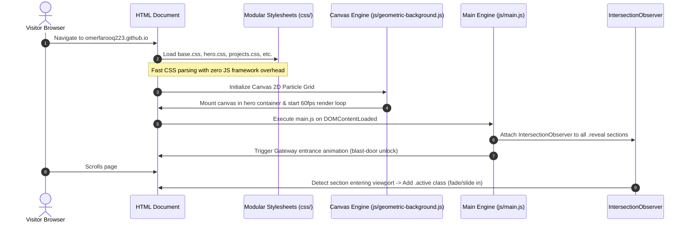
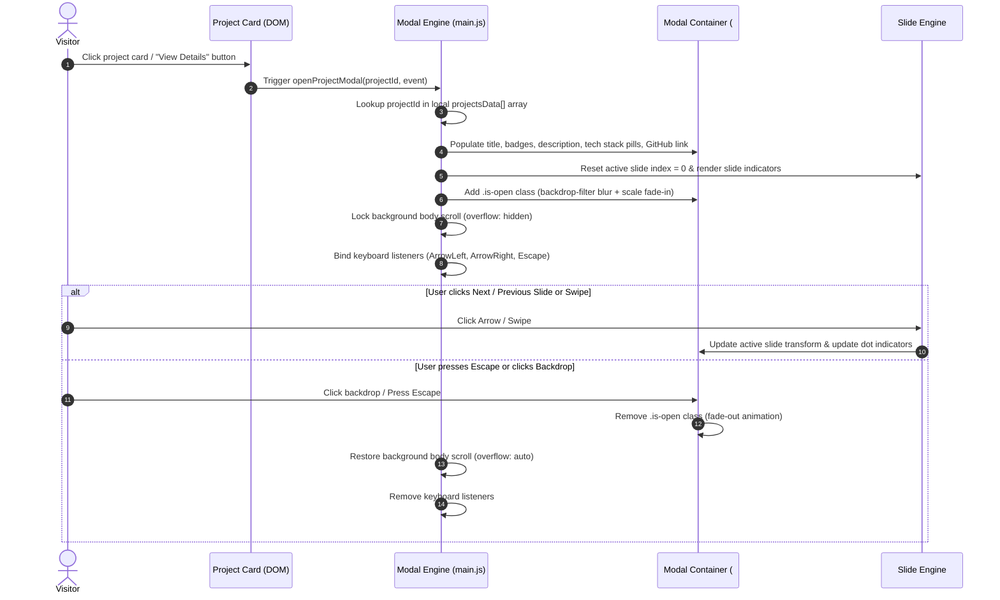
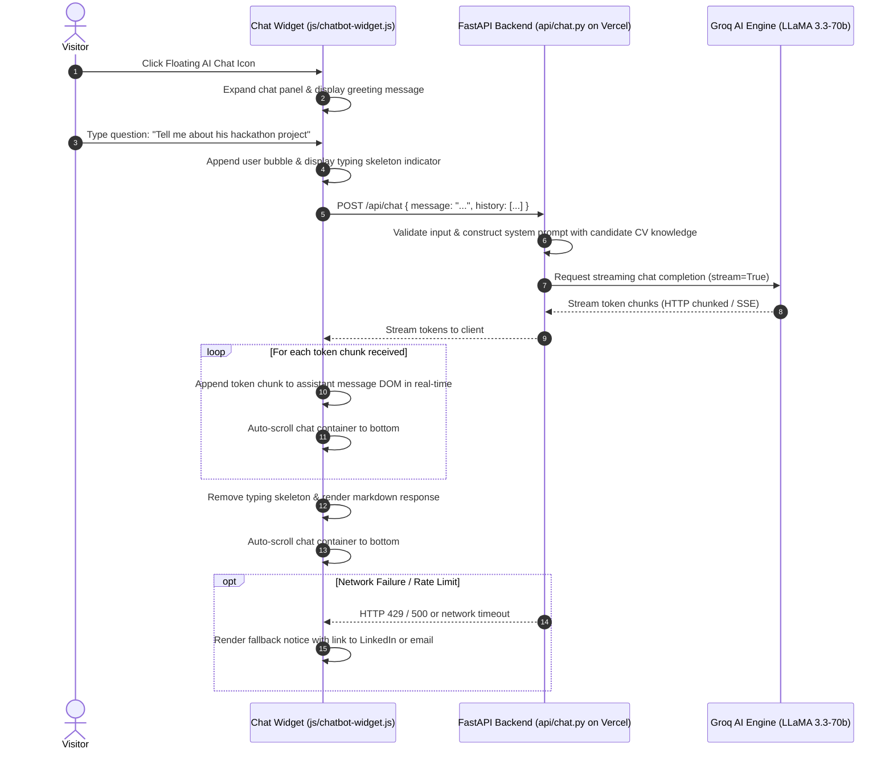
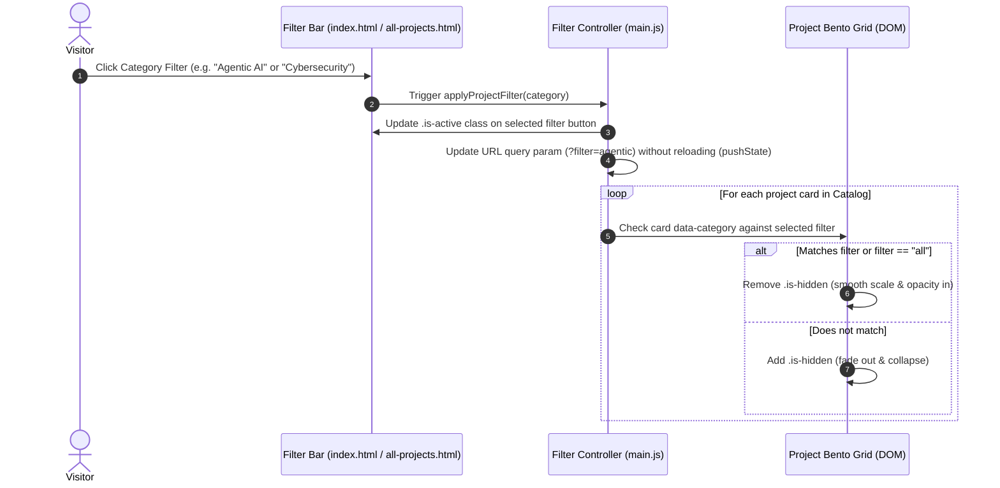

# FLOW.md — System, User & Data Behavioral Flows

This document details the definitive runtime flows, event lifecycles, and user journeys across the **Muhammad Umar Farooq Portfolio Site**.

## 1.1 Certificate Preview and Source Document Flow

1. Certificate cards render optimized WebP previews from `docs/certificates/`.
2. Selecting a card opens the shared certificate lightbox and updates its caption.
3. The lightbox's "Open in New Tab" action uses the original PDF when one is available; existing image-only certificates continue to open their WebP source.

---

## 1. Initial Page Load & Visual Initialization Flow

### Flow Notes:
1. **Gateway Animation**: When visitors first arrive, the ambient gateway transition animates out, unveiling the cyber-hero header.
2. **IntersectionObserver Performance**: Scroll events do not fire expensive layout calculations; elements observe viewport thresholds passively using the browser's native observer.
3. **Canvas Auto-Throttle**: If the user switches tabs or resizes the browser, the geometric background halts or recalculates canvas dimensions without memory leakage.
4. **Hardware-Accelerated Reading Progress**: The `#bar` element binds to the native GPU compositor via `@supports (animation-timeline: scroll())` where supported (Chromium 115+, Safari 18+). In browsers lacking support (Firefox, older iOS), `main.js` transparently falls back to GPU `transform: scaleX(progress)` with zero reflow.

---

## 2. Project Modal & Media Carousel Lifecycle Flow

---

## 3. AI Chatbot Interaction & Real-Time Streaming Flow

### Flow Notes:
1. **Shimmering Skeleton Loader**: During the async `generateAgentResponse(message)` roundtrip, the widget mounts a 3-line staggered skeleton (`.portfolio-chatbot-skeleton-wrap`) with a hardware-accelerated 4-line CSS shimmer gradient (`background-size: 200% 100%`).
2. **Instant Fluid Transition**: When the server returns the payload, the skeleton container is replaced directly by `renderMarkdown(response)` without layout jumps or flickering.
3. **Reduced Motion Adaptation**: Systems with `prefers-reduced-motion: reduce` freeze the gradient translation while maintaining clear visual placeholder cues.
4. **Resilient Dual-Tier Endpoint Resolution**: The widget attempts local `/api/chat` first. If running on a static host (GitHub Pages returning 405 or local static dev returning 404/501), it automatically falls back to `https://omerfarooq223-github-io.vercel.app/api/chat`, ensuring zero interruption across environments.

---

## 4. Project Filtering & Cross-Page Routing Flow

